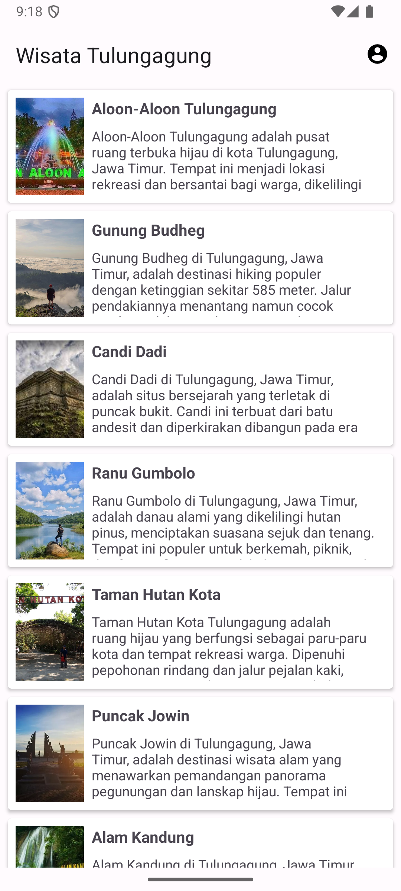
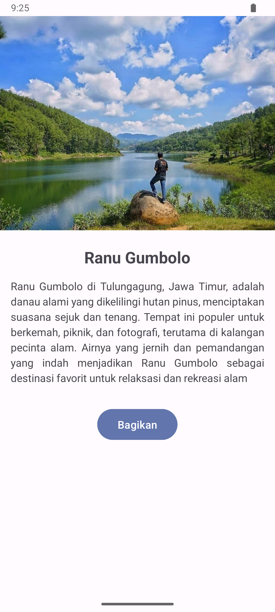

# Beginner Android App - List Wisata Tulungagung

Aplikasi Android sederhana yang menampilkan daftar objek wisata di Tulungagung. Aplikasi ini dibuat menggunakan bahasa pemrograman **Kotlin** dan memanfaatkan **RecyclerView** untuk menampilkan data wisata dalam bentuk list. Setiap item berisi nama tempat, deskripsi singkat, dan gambar.

## Features

- Menampilkan daftar tempat wisata di Tulungagung.
- Tampilan daftar menggunakan **RecyclerView** dengan ViewBinding.
- Halaman detail wisata yang menampilkan foto, deskripsi tempat, dan tombol untuk membagikan informasi wisata.
- Halaman **About** yang menampilkan informasi pembuat aplikasi (foto, nama, dan email).
- Action bar dengan menu navigasi ke halaman **About**.

## Tech

- **Kotlin**: Bahasa pemrograman utama.
- **Android SDK**: Digunakan untuk membangun aplikasi Android.
- **RecyclerView**: Menampilkan daftar objek wisata.
- **ViewBinding**: Mempermudah akses ke view dan mengurangi penggunaan `findViewById`.
- **ConstraintLayout**: Layout utama untuk membuat tata letak yang fleksibel.
- **Intent**: Untuk navigasi antar halaman.
- **Drawable Resources**: Untuk menampilkan gambar tempat wisata.

## Screenshots

## Authors

- [@ojaizyikhwan](https://github.com/jaizyikhwan)

